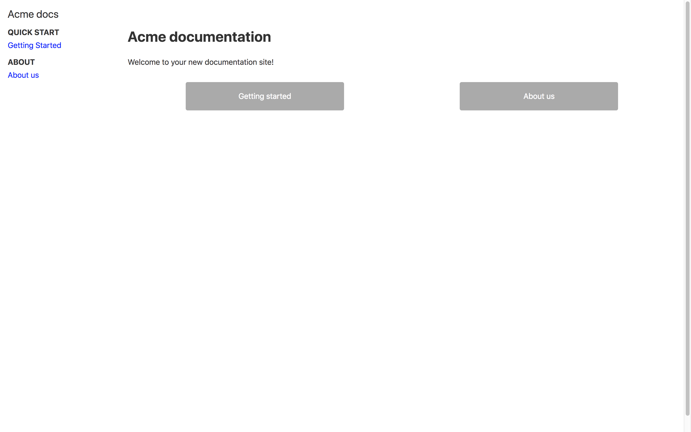

# Docs-as-code Starter Kit

You can use this repository as a starting point to manage your documentation as code.

This docs-as-code example is built on top of [Gatsby.js](https://www.gatsbyjs.org) and is part of a tutorial posted on Medium:

  * [How we switched to documentation-as-code with Gatsby.js and Netlify — part 1/2](https://blog.squadlytics.com/how-we-switched-to-documentation-as-code-with-gatsby-js-and-netlify-markdown-hosting-1-3/) 

## Getting started

Run the following commands in your CLI to serve your website locally.

```bash
git clone git@github.com:squadlytics/docs-as-code-starterkit.git
cd docs-as-code-starterkit
npm install
gatsby develop
```

You should be able to go to http://localhost:8000/ and see the docs homepage.



## Editing the docs

All the docs are written in Markdown in /src/docs. You can edit the existing pages or create new one with the following process:

  1. Create a new Markdown file in /src/docs/, for instance /src/docs/mydoc.md.
  2. Add a [Front Matter](https://jekyllrb.com/docs/frontmatter/) at the top of your doc.
  3. Make sure that the Front Matter contains the _path_ and _title_ of your doc. The path is how people will get access to the page.
  4. Write your doc in Markdown format and save it.
  5. Go to http://localhost:8000/<path_of_the_doc> to view it in your browser.

## Adding Mixpanel and DocSearch

You can add Mixpanel tracking and search via DocSearch (you'll need to sign up first) by defining environment variables in your dev environment and in your build configuration when deploying to production.

Here's below a template for a dev environment set up using a .env.development file that you should put at the root of the repository.

```
#.env.development
GATSBY_MIXPANEL_KEY=<your Mixpanel key>
GATSBY_DOCSEARCH_API_KEY=<your DocSearch API Key>
GATSBY_DOCSEARCH_INDEX=<your DocSearch index reference>
```

Check https://www.gatsbyjs.org/docs/environment-variables/ to know more about setting up environment variables.

## Deploying

You can easily deploy your docs for free with [Netlify](https://netlify.com). Check out [the tutorial](https://medium.com/squadlytics/how-we-switched-to-documentation-as-code-with-gatsby-js-and-netlify-part-1-2-1f57ad732a05) if you want a step by step guide.

## Contributing

Please feel free to submit contribution to this repository by forking it and submitting a pull request.

